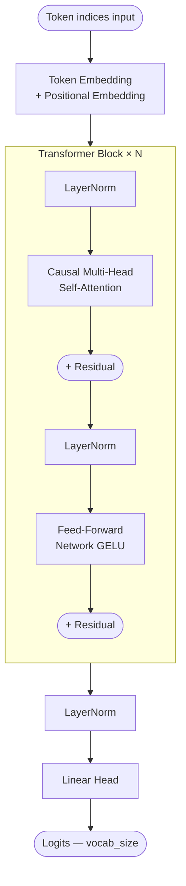
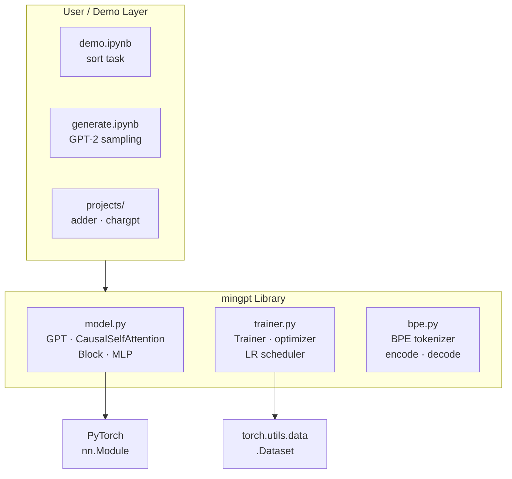
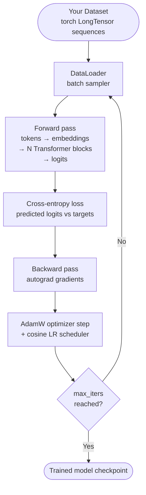
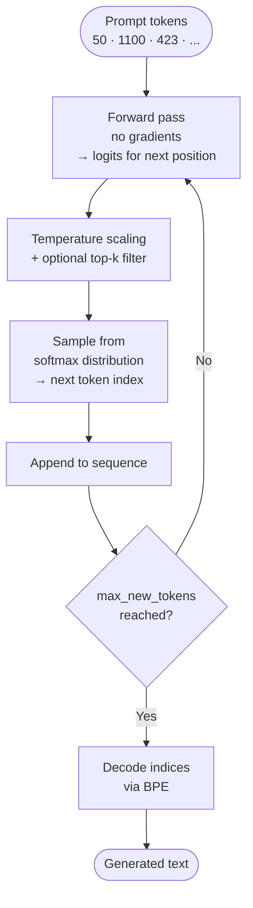

# minGPT

> A clean, hackable PyTorch re-implementation of GPT — built by **[Tamuka Manjemu](https://github.com/tamukamanjemu2-pixel)** for learning, experimentation, and fast demos.

[](https://python.org)
[](https://pytorch.org)
[](LICENSE)

---

## About this project

minGPT is a lightweight GPT playground. The philosophy: **small, readable, educational** — ~300 lines of model code, no unnecessary abstractions. Great for teaching, quick experiments, and hacking on ideas without a giant framework.

The library is just **three files**:

| File | Purpose |
|---|---|
| `mingpt/model.py` | The GPT Transformer model (~300 lines) |
| `mingpt/trainer.py` | PyTorch training loop (framework-agnostic) |
| `mingpt/bpe.py` | Byte Pair Encoding tokenizer (matches OpenAI GPT) |

---

## Model architecture

The model follows a **decoder-only Transformer** — the same family as GPT-1, GPT-2, and GPT-3.



Key design decisions from GPT-2:
- **Pre-normalization** — LayerNorm applied at the *input* of each sub-block, not the output
- **Learned positional embeddings** — the model learns position representations, not sinusoidal
- **Masked self-attention** — tokens only attend to previous positions (causal / autoregressive)
- **GELU activations** — used in the feed-forward network instead of ReLU

---

## System architecture

How the three library modules relate to each other and to the demo/project layer:



---

## Training process flow

What happens end-to-end when you call `trainer.run()`:



---

## Inference / generation flow

Once trained (or after loading pretrained GPT-2 weights):



---

## GPT family — parameter comparison

| Model | Layers | Heads | d_model | Parameters |
|---|---|---|---|---|
| GPT-1 | 12 | 12 | 768 | ~117M |
| GPT-2 small | 12 | 12 | 768 | ~124M |
| GPT-2 medium | 24 | 16 | 1024 | ~355M |
| GPT-2 large | 36 | 20 | 1280 | ~774M |
| GPT-2 XL | 48 | 25 | 1600 | ~1.5B |
| GPT-3 | 96 | 96 | 12288 | ~175B |
| iGPT-S | 24 | 8 | 512 | ~76M |

minGPT can instantiate any GPT-2 variant via `model_type`.

---

## Quickstart

### Installation

```bash
git clone https://github.com/tamukamanjemu2-pixel/min-gpt-muka.git
cd min-gpt-muka
pip install -e .
```

### Instantiate a GPT-2 model

```python
from mingpt.model import GPT

model_config = GPT.get_default_config()
model_config.model_type = 'gpt2'
model_config.vocab_size = 50257  # OpenAI vocabulary
model_config.block_size = 1024   # context length

model = GPT(model_config)
```

### Train from scratch

```python
from mingpt.trainer import Trainer

# Your subclass of torch.utils.data.Dataset
# emitting LongTensors of length up to block_size
train_dataset = YourDataset()

train_config = Trainer.get_default_config()
train_config.learning_rate = 5e-4
train_config.max_iters = 1000
train_config.batch_size = 32

trainer = Trainer(train_config, model, train_dataset)
trainer.run()
```

---

## Projects

| Project | Description |
|---|---|
| `projects/adder` | GPT trained from scratch to add numbers (inspired by GPT-3 paper) |
| `projects/chargpt` | Character-level language model on any text file |
| `demo.ipynb` | Minimal end-to-end example on a sequence sorting task |
| `generate.ipynb` | Load pretrained GPT-2 weights and generate text from a prompt |

---

## Key training hyperparameters (from the papers)

### GPT-1
- 12 layers, 12 heads, d_model 768
- Adam lr 2.5e-4, linear warmup 2000 steps, cosine decay
- 100 epochs, batch size 64, sequence length 512
- BPE vocabulary with 40,000 merges
- Dropout 0.1 on residuals, embeddings, and attention

### GPT-2
- LayerNorm moved to sub-block inputs (pre-norm)
- Extra LayerNorm after the final attention block
- Vocabulary expanded to 50,257 tokens
- Context window extended to 1024 tokens
- Residual layers scaled at init by `1/√N`

### GPT-3
- Same architecture as GPT-2, alternating dense and sparse attention
- Context window 2048 tokens
- Adam β1=0.9, β2=0.95, weight decay 0.1
- Gradient clipping at global norm 1.0
- Linear LR warmup over 375M tokens, cosine decay to 10%

---

## Running tests

```bash
python -m unittest discover tests
```

---

## Roadmap

- [ ] GPT-2 fine-tuning demo on arbitrary text file
- [ ] Dialog agent demo
- [ ] Mixed precision training (fp16/bf16)
- [ ] Distributed training support
- [ ] Benchmark reproductions (text8, language modeling)
- [ ] Load weights from models other than `gpt2-*`
- [ ] Proper logging (replace print statements)
- [ ] `requirements.txt`
- [ ] Better documented outcomes for adder and chargpt

---

## References

**Code:**
- [openai/gpt-2](https://github.com/openai/gpt-2) — TF model definition (no training code)
- [openai/image-gpt](https://github.com/openai/image-gpt) — GPT-3-style modifications
- [huggingface/transformers](https://github.com/huggingface/transformers) — full-featured but harder to trace

**Papers:**
- [Improving Language Understanding by Generative Pre-Training](https://openai.com/research/language-unsupervised) — GPT-1
- [Language Models are Unsupervised Multitask Learners](https://openai.com/research/better-language-models) — GPT-2
- [Language Models are Few-Shot Learners](https://arxiv.org/abs/2005.14165) — GPT-3
- [Generative Pretraining from Pixels](https://openai.com/research/image-gpt) — iGPT
- [Attention Is All You Need](https://arxiv.org/abs/1706.03762) — original Transformer

---

## License

MIT — see [LICENSE](LICENSE)

---

*minGPT · Tamuka Manjemu · keeping it small, keeping it alive*
